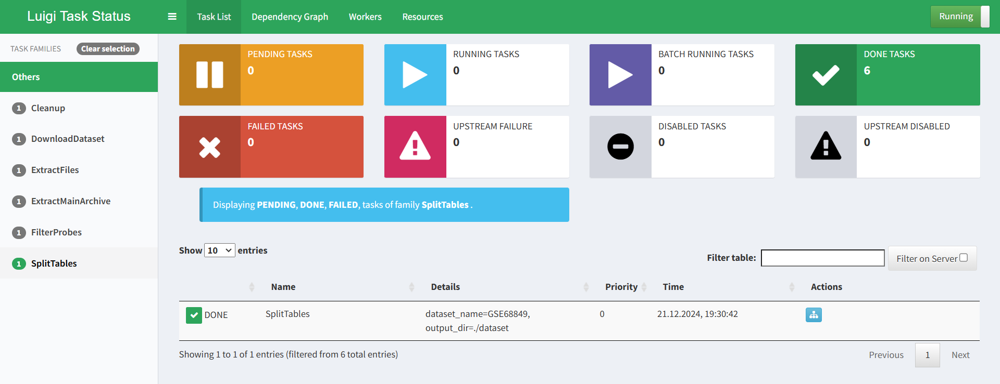
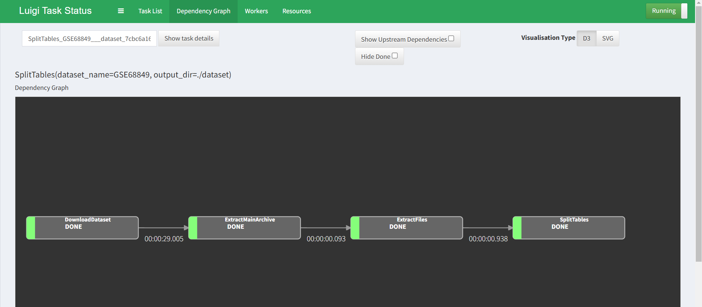

**Задача**
 * Написать пайплайн с помощью фреймворка Luigi.
**Решение**
 * Пайплан реализован в файле pipeline.py
 * Запуск с веб-демонстрацией работы на ```localhost:8082``` через командную строку VS Code```WSL2``` командой: $```python -m luigi --module pipeline Cleanup --scheduler-host localhost```
 * ```DOWN TASKS```: 
 * ```DEPENDENCY GRAPH```: 
